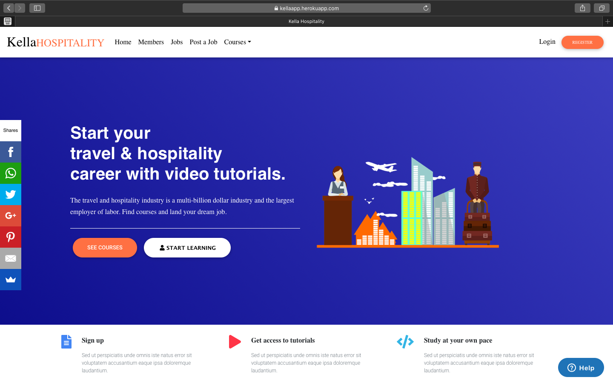
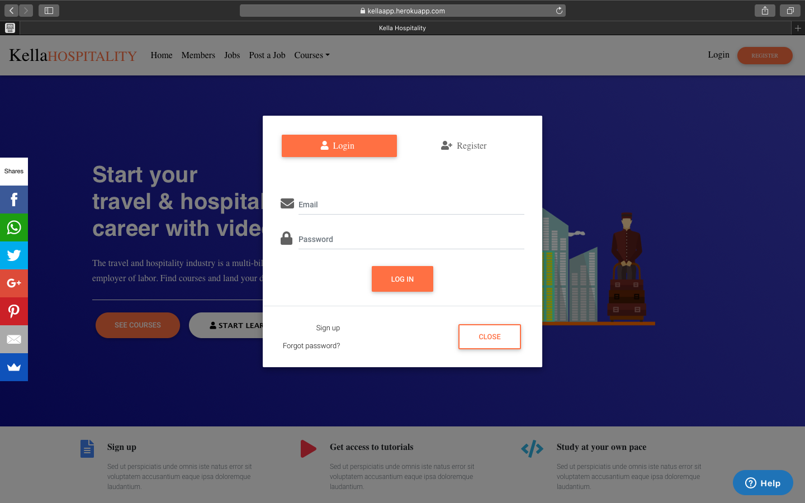
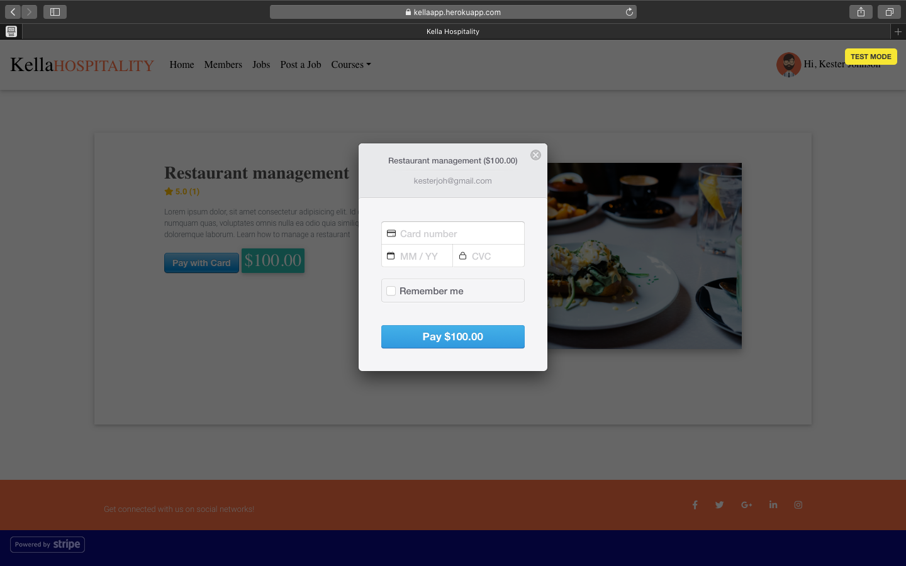
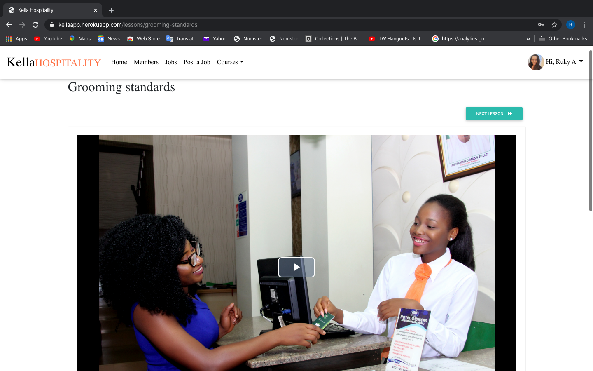
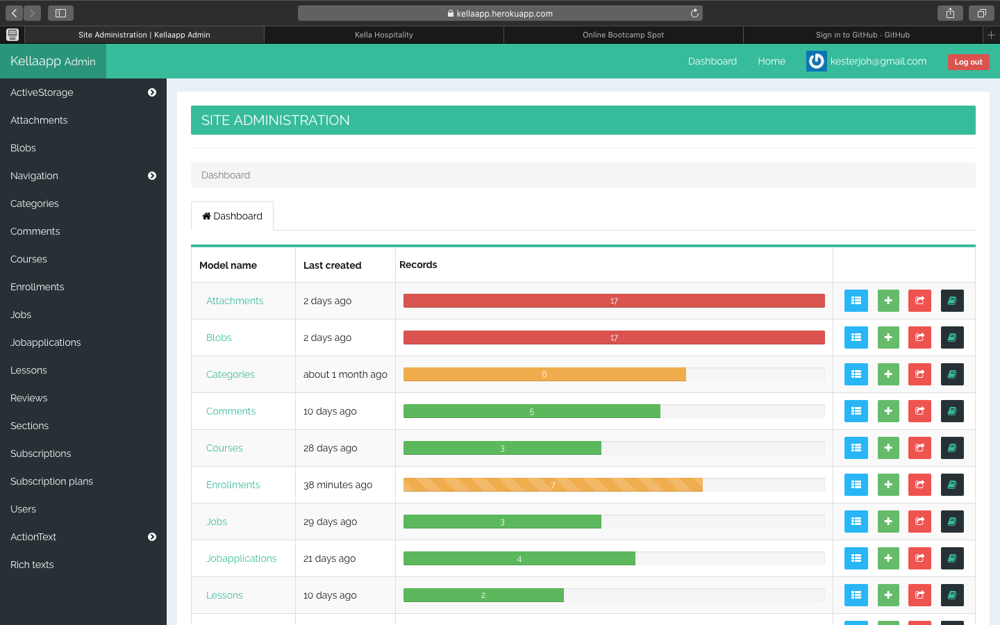

# Video Streaming Platform

 This is a video-streaming marketplace platform that features credit card payment capabilities, user role management, complex user interfaces, and advanced database relationships.

 ## Click [here](https://kellaapp.herokuapp.com/) for the live app.
  
Tools & Resources

* Built with ruby on rails and bootstrap

* Ruby version 2.6 with Rails 6.0

* Database: Postgresql

* Admin backend with railsadmin

* Payment with Stripe

* Deployed to Heroku

* Aws Storage

  

  Homepage:

  

  User register/login page:
  
  
  

  Enrollment with stripe:
  
  

  Video lessons: 
 
  

  Admin dasboard:
  
  

 
